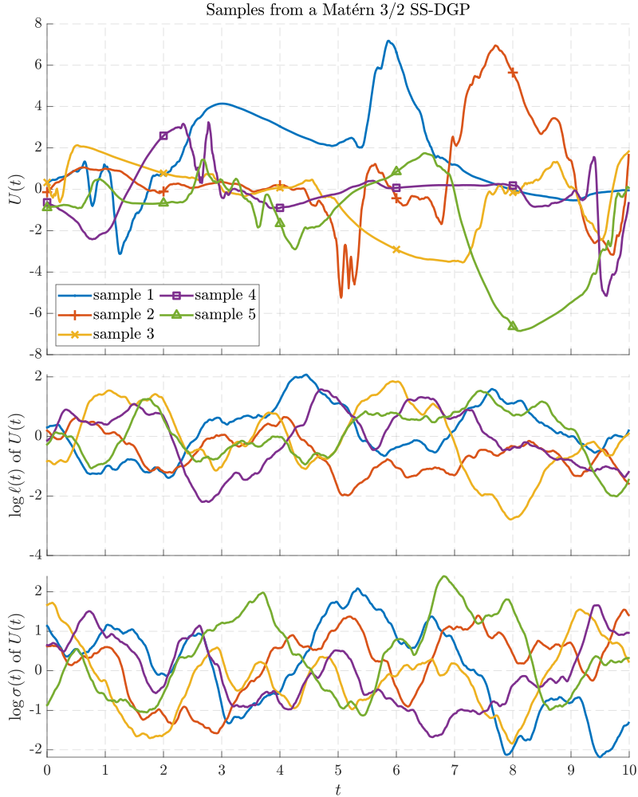

# State-space deep Gaussian processes in Python and Matlab

[](https://github.com/zgbkdlm/ssdgp/actions/workflows/py_unittest.yml)

This repository contains Python and Matlab implementations of state-space deep Gaussian processes (SS-DGPs).

The so-called SS-DGPs are a class of non-statioanry stochastic processes that are governed by stochastic differential equations. These processes are particularly useful in modelling ill-behaving functions/signals that have time-varying characteristics. Moreover, thanks to their Markovian structure, regression problems associated with the SS-DGP priors can be efficiently solved in linear computational time (w.r.t. the number of data) by using Bayesian filters and smoothers. 

The figure below illustrates a few samples drawn from a SS-DGP of Matern family, where you can see the manifestation of temporal non-stationary behaviours of process `U(t)`.



# About the codes

You can find two folders `./matlab` and `./python_notebooks` which contain implementations of SS-DGPs in Matlab and Python (notebook), respectively. Please navigate to these folders and refer to their readme files to see on how to use the codes in practice. 

# Citation

```bibtex
@article{Zhao2020SSDGP,
	title={Deep State-space {G}aussian Processes},
	author={Zheng Zhao and Muhammad Emzir and Simo S{\"a}rkk{\"a}},
	journal={Statistics and Computing},
	volume={31},
	number={6},
	pages={75},
	year={2021},
	note={in press}
}
```
(Accepted for publication in Statistics and Computing, preprint can be found at [https://arxiv.org/abs/2008.04733](https://arxiv.org/abs/2008.04733))

```bibtex
@phdthesis{Zhao2021Thesis,
	title = {State-space deep Gaussian processes},
	author = {Zheng Zhao},
	school = {Aalto University},
	year = {2021},
}
```
(will be published around the end of 2021)

# License

The GNU General Public License v3 or later.

# Contact

Zheng Zhao, Aalto University, zheng.zhao@aalto.fi, zz@zabemon.com.
